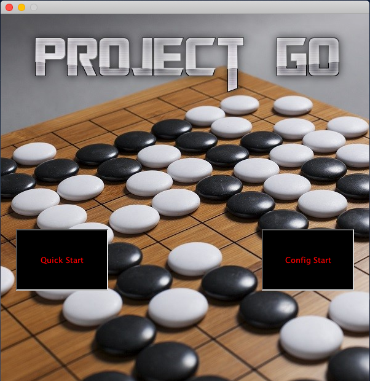

# GO

The Final Frontier

## Team

1. [Gabriel Hartman](https://github.com/ghartman1620)
2. [Pallavi Chaturvedi](https://github.com/pallavichaturvedi)
3. [Parvathy Kannankumarath Madom Krishnan](https://github.com/parvathysjsu)
4. [Ward Huang](https://github.com/Huang-W)
5. [Yash Sahani](https://github.com/ysahani)

## User Story Advertisement

[Advertisement link for our Go application](https://www.youtube.com/watch?v=v47HjLz63co&feature=youtu.be)

## Project Description

* [Game Rules](https://senseis.xmp.net/?BasicRulesOfGo) 

* [Project Repository](https://github.com/nguyensjsu/fa19-202-underwater-softball) 

## Design

#### Top Level Diagram

#### Adapter Diagram

#### Model Diagram

#### View Diagram

## Design Notes

### Model View Controller (MVC)
We used the Model View Controller architecture for this project.  The Controller basically retrieves information regarding where the user clicks on the screen. As the user clicks the screen multiple times to set a piece on the board, this is a value that is constantly changing.  The model then gets this information, and passes it to the view.  Thus the view, or the "UI", is also constantly changing accordingly with the values that it is getting from the model.  

### Adapter
We implemented the Adapter Design Pattern by including ModelViewAdapter and ViewModelAdapter classes in the project. The ModelViewAdapter translates the game coordinates(For Ex. (1,1)) from the game model into pixel coordinates(For Ex. (280,350)) for the game view. Whereas, the ViewModelAdapter class translates mouse clicks(For Ex. (280,350)) sent from the GoView screens into the game coordinates(For Ex. (1,1)) that can be used by the game model. Moreover, This class forwards pass, undo and the game configuration requests to the game model.

### Composite
Composite pattern was used for the main menu screen.  In the menu screen, there is a "Quick Start" button, and a "Config Start" button.  Both of these buttons were added as 
### Observer
We Implemented Observer Design Pattern in the Model as well as View package of the project.

#### In Model package 

* GoGameObserver is an interface for objects that listen to when the Go game ends. Implementations can register themselves to   be notified at {@link GoGameSubject}

* GoModelConfigObserver is an interface for objects that listen to changes in the Go Game configuration. Implementations         can register themselves to be notified at {@link GoGameSubject}

* GoMoveObserver is an interface for objects that listen to Go Move events. Implementations can register themselves to be       notified at {@link GoGameSubject}

* GoGameSubject is a subject that notifies its observers of when interesting events happen in a game of Go. A subject notifies   a set of observers when a move is made or a piece is captured, and notifies a different set of observers when the game ends   and a winner is decided.
 
#### In View package

* GoScreenObserver is an interface for objects that listen to the User's Input. Implementations can register themselves to be   notified at {@link GoGameSubject}

* GoViewConfigObserver is an interface for objects that listen to when the Go game changes configuration. Implementations can   register themselves to be notified at {@link GoGameSubject}

* GoViewObserver is an interface for objects that listen to Go UI events. Implementations can register themselves to be         notified at {@link GoViewSubject}

* GoScreenSubject is a subject that notifies its observers of when interesting events happen in the screen of a game of Go. A   subject notifies a set of observers when the screen is clicked or when a button is clicked.

* GoViewConfigSubject is a subject that notifies its observers when the GoGame is being configured and when the BoardSize has   changed

* GoViewSubject is a subject that notifies its observers of user inputs in a game of Go and about the event when the screen is   clicked or when a button is clicked.
